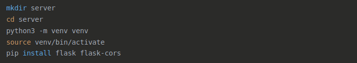

# Проектування та розробка кросплатформного модульного веб-додатка для спрощення повсякденних завдань

## Зміст
```
Вступ
1. ТЕОРЕТИЧНІ ОСНОВИ РОЗРОБКИ КРОСПЛАТФОРМНИХ ВЕБ-ДОДАТКІВ
    1.1 Аналіз сучасних технологій веб-розробки
        1.1.1 Клієнтські технології веб-розробки
        1.1.2 Серверні технології веб-розробки
    1.2 Кросплатформеність у веб-розробці
        1.2.1 Основні принципи забезпечення кросплатформеності
        1.2.2 Виклики та обмеження кросплатформеності
        1.2.3 Перспективи розвитку кросплатформної веб-розробки
2. ПРОЕКТУВАННЯ КРОСПЛАТФОРМНОГО МОДУЛЬНОГО ВЕБ-ДОДАТКА
    2.1 Етапи створення веб-додатка
    2.2 Проектування користувацького інтерфейсу
3. ПРОГРАМНА РЕАЛІЗАЦІЯ ПРОЄКТУ
    3.1 Розробка клієнтської частини
    3.2 Розробка серверної частини
    3.3 Інтеграція клієнтської та серверної частин
    3.4 Тестування розробленого веб-додатка
Висновки
Перелік посилань
```
## Вступ

У сучасному світі інформаційних технологій спостерігається стрімке зростання потреби в програмних рішеннях, які здатні спростити виконання повсякденних завдань та підвищити продуктивність користувачів. Особливого значення набувають веб-додатки, що завдяки своїй доступності через мережу Інтернет та можливості використання на різних платформах, стають незамінними інструментами як для бізнесу, так і для приватних осіб. В умовах цифрової трансформації суспільства розробка ефективних, кросплатформних та модульних веб-рішень є актуальною та перспективною галуззю програмної інженерії.

Кросплатформні веб-додатки дозволяють подолати обмеження, пов'язані з використанням різних операційних систем та пристроїв, забезпечуючи універсальний доступ до функціональності незалежно від технічних характеристик обладнання користувача. Модульна архітектура, в свою чергу, надає можливість гнучкого масштабування системи, ефективного управління її компонентами та адаптації до змінних вимог користувачів.

Статистичні дані свідчать про те, що світовий ринок веб-розробки щороку зростає на 15-20%, а за прогнозами аналітиків, до кінця 2025 року його обсяг перевищить 240 мільярдів доларів США. При цьому близько 70% користувачів надають перевагу веб-додаткам, які мають інтуїтивно зрозумілий інтерфейс та можуть використовуватися на різних типах пристроїв без втрати функціональності.

Актуальність теми дослідження зумовлена потребою в розробці універсальних програмних рішень, які дозволяють автоматизувати та спростити виконання повсякденних завдань, оптимізувати робочі процеси та підвищити загальну ефективність діяльності користувачів. В умовах збільшення кількості різноманітних цифрових пристроїв та операційних систем, забезпечення кросплатформності стає критично важливим аспектом сучасного програмного забезпечення.

Об'єктом дослідження є процес проєктування та розробки веб-додатків для спрощення повсякденних завдань користувачів.
Предметом дослідження є методи, технології та інструменти створення кросплатформних модульних веб-додатків з використанням сучасних фреймворків та бібліотек.

Метою дипломної роботи є розробка ефективного кросплатформного модульного веб-додатка для спрощення повсякденних завдань із застосуванням сучасних технологій веб-розробки (React, Material UI для клієнтської частини та Python для серверної частини).
Для досягнення поставленої мети необхідно вирішити наступні завдання:

1. Проаналізувати сучасні підходи до розробки кросплатформних модульних веб-додатків та визначити оптимальні технології для реалізації проєкту.
2. Дослідити принципи модульної архітектури програмного забезпечення та можливості їх застосування при розробці веб-додатків.
3. Сформувати функціональні та нефункціональні вимоги до системи на основі аналізу потреб користувачів.
4. Розробити архітектуру веб-додатка, що забезпечить його кросплатформність, модульність та масштабованість.
5. Спроєктувати та реалізувати інтуїтивно зрозумілий користувацький інтерфейс з використанням React та Material UI.
6. Розробити серверну частину веб-додатка на мові програмування Python, забезпечивши ефективну взаємодію з клієнтською частиною.
7. Провести комплексне тестування розробленого веб-додатка та оптимізувати його продуктивність.

Методи дослідження базуються на теоретичних та практичних підходах до розробки програмного забезпечення, включаючи системний аналіз, об'єктно-орієнтоване проєктування, методи тестування та оптимізації веб-додатків. У роботі застосовуються сучасні методології гнучкої розробки програмного забезпечення, зокрема Agile та Scrum, які дозволяють ефективно управляти процесом створення веб-додатка на всіх етапах його життєвого циклу.

Практичне значення отриманих результатів полягає в розробці функціонального кросплатформного модульного веб-додатка, що може бути використаний для автоматизації та спрощення виконання повсякденних завдань. Запропоновані в роботі архітектурні рішення та підходи до проєктування можуть бути застосовані при розробці інших веб-орієнтованих систем з подібною функціональністю.
Наукова новизна отриманих результатів полягає в удосконаленні методів проєктування та розробки кросплатформних модульних веб-додатків через інтеграцію сучасних JavaScript-фреймворків (React) з Python-орієнтованими серверними рішеннями, а також у створенні оптимізованої архітектури, що забезпечує ефективну взаємодію компонентів системи на різних рівнях.

- У першому розділі дипломної роботи проводиться аналіз теоретичних основ розробки кросплатформних модульних веб-додатків, досліджуються сучасні технології веб-розробки, принципи модульної архітектури програмного забезпечення та аспекти забезпечення кросплатформності.
- Другий розділ присвячений проєктуванню кросплатформного модульного веб-додатка. В ньому здійснюється аналіз вимог до системи, розробка архітектурних рішень та проєктування користувацького інтерфейсу з урахуванням принципів UX/UI дизайну.
- У третьому розділі описується процес розробки та тестування веб-додатка, включаючи вибір технологічного стеку, реалізацію серверної та клієнтської частин, а також методи тестування та оптимізації розробленого рішення.

Технологічний стек, обраний для реалізації проєкту, включає React і Material UI для клієнтської частини, що забезпечує створення сучасного, інтерактивного та адаптивного інтерфейсу користувача. Для розробки серверної частини використовується мова програмування Python та фреймворки, які дозволяють ефективно обробляти запити клієнтів, взаємодіяти з базами даних та реалізовувати необхідну бізнес-логіку.

React, як провідна бібліотека для створення користувацьких інтерфейсів, забезпечує компонентний підхід до розробки, що повністю відповідає принципам модульної архітектури. Material UI надає готові компоненти, які реалізують концепцію Material Design від Google, що дозволяє створити естетично привабливий та функціональний інтерфейс.

Python, у свою чергу, є високорівневою мовою програмування, яка відрізняється простотою синтаксису, широкими функціональними можливостями та наявністю великої кількості бібліотек та фреймворків для веб-розробки. Використання Python для серверної частини дозволяє ефективно реалізувати необхідну логіку обробки даних та забезпечити надійну роботу веб-додатка.

Таким чином, дана дипломна робота спрямована на дослідження та практичне застосування сучасних підходів до розробки кросплатформних модульних веб-додатків, що дозволить створити ефективне програмне рішення для спрощення повсякденних завдань користувачів.


## 1. ТЕОРЕТИЧНІ ОСНОВИ РОЗРОБКИ КРОСПЛАТФОРМНИХ МОДУЛЬНИХ ВЕБ-ДОДАТКІВ

### 1.1 Аналіз сучасних технологій веб-розробки

Сучасний світ веб-розробки характеризується стрімким розвитком та диверсифікацією технологій, що дозволяють створювати все більш складні, інтерактивні та ефективні рішення. За останні десятиліття веб-розробка пройшла шлях від статичних HTML-сторінок до комплексних, високонавантажених та функціонально багатих веб-додатків, які за своїми можливостями не поступаються нативним програмам. Аналіз сучасних технологій веб-розробки є необхідним кроком для обґрунтованого вибору інструментарію при створенні кросплатформного модульного веб-додатка.

#### 1.1.1 Клієнтські технології веб-розробки

Клієнтська частина веб-додатків традиційно базується на тріаді технологій: HTML, CSS та JavaScript. HTML (HyperText Markup Language) у своїй останній версії HTML5 забезпечує структурування контенту веб-сторінок та надає розширені можливості для роботи з мультимедіа, графікою та інтерактивними елементами. За даними W3C (World Wide Web Consortium), стандарт HTML5 офіційно рекомендований з жовтня 2014 року і продовжує розширюватися новими функціональними можливостями [1].

- CSS (Cascading Style Sheets) відповідає за презентаційний аспект веб-сторінок, дозволяючи визначати їх зовнішній вигляд та адаптивність. Сучасна специфікація CSS3, розроблена W3C, включає модулі для створення анімацій, градієнтів, тіней, гнучких макетів та багато іншого. Особливої уваги заслуговує технологія CSS Grid Layout та Flexbox, які, за даними досліджень Stack Overflow Developer Survey 2023, використовуються у понад 85% сучасних веб-проєктів для створення адаптивних інтерфейсів [2].
- JavaScript залишається основною мовою програмування для клієнтської частини веб-додатків, забезпечуючи їх інтерактивність та функціональність. Згідно з даними GitHub State of the Octoverse 2023, JavaScript є найпопулярнішою мовою програмування на платформі, з більш ніж 2,8 мільйона активних репозиторіїв [3]. ECMAScript 2023 (ES14) є останньою специфікацією JavaScript, яка постійно збагачується новими можливостями для спрощення розробки та підвищення продуктивності праці програмістів.

Сучасна веб-розробка тісно пов'язана з використанням JavaScript-фреймворків та бібліотек, які значно спрощують створення складних веб-додатків, забезпечують структурованість коду та підвищують його підтримуваність. Аналіз ринку фронтенд-розробки дозволяє виділити декілька провідних технологій:

- React – бібліотека для створення користувацьких інтерфейсів, розроблена Facebook (Meta). Згідно з офіційною документацією, React базується на компонентному підході, що дозволяє створювати багаторазово використовувані UI-компоненти та ефективно керувати їх станом [4]. За даними npm (Node Package Manager), React має понад 14 мільйонів щотижневих завантажень, що свідчить про його широке визнання в спільноті розробників. Технологія віртуального DOM (Document Object Model), що лежить в основі React, забезпечує високу продуктивність при оновленні інтерфейсу. Згідно з дослідженням State of JS 2023, 80% опитаних розробників використовують React у своїх проєктах, що робить його лідером серед фронтенд-технологій [5].
- Angular – повноцінний фреймворк для розробки веб-додатків, створений та підтримуваний Google. Angular реалізує архітектуру Model-View-Controller (MVC) та надає широкий спектр інструментів для створення складних корпоративних додатків. Відповідно до офіційної документації, Angular 17, випущений у листопаді 2023 року, представив значні покращення в продуктивності та розмірі бандлів завдяки новому рендеру Ivy [6]. За даними Google Trends, Angular залишається одним із найбільш затребуваних фреймворків, особливо в корпоративному секторі та в проєктах, що вимагають суворої типізації завдяки інтеграції з TypeScript.
- Vue.js – прогресивний JavaScript-фреймворк, який, за даними офіційного сайту, фокусується на створенні інтерфейсів користувача з поступовим впровадженням у існуючі проєкти [7]. Vue.js поєднує найкращі концепції Angular та React, пропонуючи двосторонню прив'язку даних та реактивну архітектуру. З випуском Vue 3 у вересні 2020 року було представлено Composition API, яке значно покращило організацію логіки компонентів та можливості повторного використання коду. За даними State of JS 2023, Vue.js посідає третє місце за популярністю серед JavaScript-фреймворків, з 47% розробників, які активно його використовують [5].

Сучасна розробка інтерфейсів неможлива без використання CSS-фреймворків та методологій, які забезпечують структурованість, масштабованість та узгодженість стилів:

- Bootstrap – найпопулярніший CSS-фреймворк, розроблений Twitter. За даними офіційного сайту, Bootstrap 5 забезпечує респонсивну сітку, готові компоненти та JavaScript-плагіни для створення адаптивних веб-інтерфейсів [9]. Згідно з дослідженням W3Techs, Bootstrap використовується на 20% усіх веб-сайтів у світі, що підтверджує його домінуючу позицію на ринку.
- Tailwind CSS – утилітарний CSS-фреймворк, який, згідно з офіційною документацією, фокусується на надання низькорівневих утилітарних класів для побудови дизайну безпосередньо в HTML [10]. За даними npm, Tailwind CSS демонструє найбільше зростання популярності серед CSS-фреймворків, з більш ніж 3 мільйонами щотижневих завантажень. Підхід "utility-first" значно прискорює розробку та мінімізує необхідність написання власного CSS-коду.
- Material UI – бібліотека React-компонентів, яка реалізує принципи Material Design від Google. Згідно з офіційним сайтом, Material UI пропонує понад 1000 готових компонентів, які можна легко інтегрувати в React-додатки [11]. Бібліотека має понад 5 мільйонів щотижневих завантажень на npm та використовується в проєктах різного масштабу – від невеликих стартапів до корпоративних додатків.


#### 1.1.2 Серверні технології веб-розробки

Розробка серверної частини веб-додатків характеризується різноманіттям мов програмування та фреймворків, кожен з яких має свої переваги та особливості застосування:

- Node.js – середовище виконання JavaScript на сервері, що базується на V8 JavaScript Engine від Google. За даними офіційного сайту, Node.js використовує неблокуючу модель введення-виведення, орієнтовану на події, що робить його легким та ефективним для високонавантажених веб-додатків [14]. Згідно з дослідженням Node.js Survey, проведеним Node.js Foundation, 77% респондентів використовують Node.js для веб-додатків, а 43% – для корпоративних рішень. Express.js залишається найпопулярнішим фреймворком для Node.js, з понад 18 мільйонами щотижневих завантажень на npm.
- Python – високорівнева мова програмування загального призначення, яка, згідно з дослідженням Stack Overflow Developer Survey 2023, посідає третє місце за популярністю серед мов програмування [2]. Для веб-розробки на Python найчастіше використовуються фреймворки Django та Flask. Django, за даними офіційного сайту, є високорівневим Python-фреймворком, який дотримується принципу "batteries included" та забезпечує швидку розробку безпечних та підтримуваних веб-додатків [15]. Flask, у свою чергу, є мікрофреймворком, який надає мінімальний набір інструментів для створення веб-додатків, дозволяючи розробникам більше свободи у виборі компонентів.
- PHP – скриптова мова програмування, спеціально розроблена для веб-розробки. За даними W3Techs, PHP використовується на 77,5% усіх веб-сайтів, серверна мова програмування яких відома [16]. Laravel є найпопулярнішим PHP-фреймворком, що пропонує елегантний синтаксис та широкий набір інструментів для розробки сучасних веб-додатків. Згідно з дослідженням JetBrains PHP Technology Report, 74% PHP-розробників використовують Laravel у своїх проєктах.
- Java – об'єктно-орієнтована мова програмування, яка, за даними TIOBE Index, стабільно входить до трійки найпопулярніших мов програмування у світі [17]. Spring Boot є провідним фреймворком для розробки веб-додатків на Java, що забезпечує швидке створення автономних, продакшн-готових Spring-додатків. Згідно з дослідженням JRebel Java Technology Report, 74% Java-розробників використовують Spring Boot у своїх проєктах.
- Ruby – динамічна, об'єктно-орієнтована мова програмування з акцентом на простоту та продуктивність. Ruby on Rails, за даними офіційного сайту, є фреймворком, що дотримується принципів "convention over configuration" та "don't repeat yourself", що значно прискорює процес розробки [18]. Незважаючи на те, що популярність Ruby дещо знизилася за останні роки, згідно з даними GitHub, мова все ще активно використовується для розробки веб-додатків, особливо в стартап-середовищі.


### 1.2 Кросплатформеність у веб-розробці

Кросплатформеність у контексті веб-розробки визначається як здатність веб-додатків функціонувати з однаковою ефективністю та функціональністю на різних операційних системах, пристроях та веб-браузерах. У сучасному цифровому середовищі, де користувачі отримують доступ до веб-ресурсів з різноманітних пристроїв – від настільних комп'ютерів і ноутбуків до планшетів і смартфонів – розробка кросплатформних веб-додатків стає критично важливою для забезпечення широкого охоплення аудиторії та позитивного користувацького досвіду.

За даними StatCounter, станом на квітень 2024 року світовий розподіл ринку операційних систем виглядає наступним чином: Windows – 72,51%, MacOS – 15,12%, Linux – 2,76%, Chrome OS – 1,84%, а також мобільні платформи: Android – 42,56%, iOS – 28,14% [19]. Водночас, ринок веб-браузерів демонструє такий розподіл: Chrome – 64,73%, Safari – 19,65%, Edge – 5,83%, Firefox – 3,04%, Opera – 2,35%, Samsung Internet – 2,14% [20]. Ці статистичні дані підкреслюють неоднорідність технічного середовища, в якому мають функціонувати сучасні веб-додатки, та обґрунтовують необхідність застосування кросплатформних підходів до їх розробки.

#### 1.2.1 Основні принципи забезпечення кросплатформеності

Забезпечення кросплатформеності у веб-розробці ґрунтується на ряді фундаментальних принципів та підходів:

**1. Адаптивний та респонсивний дизайн**. Згідно з визначенням W3C, респонсивний веб-дизайн (RWD) – це підхід, який забезпечує оптимальний досвід перегляду веб-сторінок на різних пристроях шляхом автоматичного адаптування макету сторінки до розміру екрана та орієнтації пристрою [21]. Основними компонентами респонсивного дизайну є:

- **Гнучкі сітки (Fluid Grids)**: використання відносних одиниць (відсотки, em, rem) замість фіксованих (пікселі) для визначення розмірів елементів;
- **Гнучкі зображення (Flexible Images)**: масштабування зображень пропорційно до розміру контейнера;
- **Медіа-запити (Media Queries)**: CSS-конструкції, що дозволяють застосовувати різні стилі в залежності від характеристик пристрою.

За даними Google, 61% користувачів з більшою ймовірністю швидко залишать сайт, якщо він не оптимізований для мобільних пристроїв, а 74% користувачів з більшою ймовірністю повернуться на сайт, якщо він адаптований для мобільних пристроїв [22]. Це підкреслює важливість адаптивного дизайну як ключового компонента кросплатформності.

**2. Прогресивне поліпшення (Progressive Enhancement)**. Концепція прогресивного поліпшення, сформульована в рекомендаціях W3C, передбачає розробку веб-додатків з базовим рівнем функціональності, який доступний усім браузерам та пристроям, з поступовим додаванням більш складних функцій для сучасних браузерів [23]. Цей підхід забезпечує:

- **Базову функціональність**: усі користувачі отримують доступ до основного контенту та функцій;
- **Розширену функціональність**: користувачі з більш сучасними браузерами отримують додаткові функції та покращений інтерфейс;
- **Стійкість до відмов**: веб-додаток продовжує функціонувати навіть при неповній підтримці всіх технологій.

За дослідженням Stack Overflow, 85% розробників вважають прогресивне поліпшення важливою стратегією для забезпечення кросплатформності [24].

**3. Стандартизація та дотримання веб-стандартів**. World Wide Web Consortium (W3C) та WHATWG (Web Hypertext Application Technology Working Group) розробляють та підтримують стандарти веб-технологій, які забезпечують сумісність та інтероперабельність веб-додатків на різних платформах [25]. Дотримання цих стандартів є критично важливим для кросплатформного веб-розробника:

- **HTML5**: стандартизований мова розмітки для структурування та представлення контенту;
- **CSS3**: стандартизована мова стилів для презентаційного оформлення;
- **ECMAScript (JavaScript)**: стандартизована специфікація скриптової мови.

Згідно з даними W3C, веб-сторінки, що відповідають стандартам, демонструють на 15-20% кращу продуктивність на різних пристроях та в 1,3 рази частіше забезпечують безперешкодний користувацький досвід [26].

#### 1.2.2 Виклики та обмеження кросплатформеності

Незважаючи на значний прогрес у технологіях кросплатформної веб-розробки, існують певні виклики та обмеження, які необхідно враховувати:

1. Різні веб-браузери використовують різні рушії для обробки та відображення веб-сторінок:

- **Blink**: використовується в Chrome, Edge (нові версії), Opera;
- **WebKit**: використовується в Safari;
- **Gecko**: використовується в Firefox.

2. Особливості реалізації стандартів у цих рушіях можуть призводити до розбіжностей у відображенні та функціонуванні веб-додатків. За даними Mozilla Developer Network, навіть при дотриманні стандартів, до 15% CSS-властивостей та 8% JavaScript API можуть демонструвати відмінності у поведінці між браузерами [35].
3. Мобільні пристрої часто мають обмежені ресурси (процесор, пам'ять, батарея) порівняно з настільними комп'ютерами, що може впливати на продуктивність веб-додатків. За дослідженням Google, 53% користувачів залишають мобільні сайти, якщо вони завантажуються довше 3 секунд [36]. Це створює додаткові вимоги до оптимізації веб-додатків для мобільних платформ.
4. Різні типи пристроїв передбачають різні способи взаємодії з користувачем: клік миші на настільних комп'ютерах, тач-взаємодія на мобільних пристроях, жести на планшетах тощо. За даними Nielsen Norman Group, ефективний інтерфейс для настільних комп'ютерів може бути незручним для мобільних пристроїв, і навпаки, що вимагає адаптації користувацького інтерфейсу до особливостей кожної платформи [37].

#### 1.2.3 Перспективи розвитку кросплатформної веб-розробки

Сучасні тенденції розвитку веб-технологій свідчать про подальше зростання важливості кросплатформності:

- WebAssembly – бінарний формат інструкцій, розроблений як портативна ціль компіляції для високопродуктивних програм на веб. За даними W3C, WebAssembly забезпечує продуктивність, близьку до нативної, для веб-додатків і підтримується всіма основними браузерами [38]. Згідно з дослідженням Stack Overflow Developer Survey, інтерес до WebAssembly серед розробників зріс на 35% у 2023 році порівняно з попереднім роком [2].
- Project Fugu – спільна ініціатива Google, Microsoft, Intel та Samsung, спрямована на розширення можливостей веб-платформи для подолання розриву між веб та нативними додатками. Згідно з офіційною документацією, Project Fugu включає розробку API для доступу до системних функцій, таких як Bluetooth, USB, файлова система та сенсори пристроїв [39]. За даними Google I/O 2023, понад 70% цих API вже доступні або знаходяться на стадії розробки [40].

Таким чином, кросплатформеність у веб-розробці є критично важливим аспектом сучасного програмного забезпечення, що дозволяє забезпечити широке охоплення користувачів та підвищити ефективність розробки за рахунок повторного використання коду. Сучасні технології та підходи, такі як респонсивний дизайн, прогресивні веб-додатки та кросплатформні фреймворки, надають розробникам потужні інструменти для створення веб-додатків, що ефективно функціонують на різних платформах, пристроях та браузерах. Водночас, постійний розвиток веб-стандартів та нових технологій, таких як WebAssembly та Project Fugu API, відкриває нові перспективи для подальшого розвитку кросплатформної веб-розробки та зближення можливостей веб та нативних додатків.


## 2. ПРОЕКТУВАННЯ КРОСПЛАТФОРМНОГО МОДУЛЬНОГО ВЕБ-ДОДАТКА

### 2.1 Етапи створення веб-додатка

Створення веб-додатка є комплексним процесом, який складається з послідовних етапів, кожен з яких має свою специфіку та критичне значення для успішної реалізації проєкту. Дотримання структурованого підходу до розробки дозволяє мінімізувати ризики, оптимізувати використання ресурсів та забезпечити високу якість кінцевого продукту.

1. Аналіз вимог та визначення цілей

На початковому етапі розробки веб-додатка необхідно чітко визначити його призначення, функціональні та нефункціональні вимоги, а також очікування користувачів. За даними дослідження Standish Group, 31% проєктів з розробки програмного забезпечення не досягають своїх цілей саме через неправильне визначення вимог [41]. Ключові аспекти аналізу вимог включають:

- Визначення основної мети веб-додатка та проблем, які він повинен вирішувати;
- Ідентифікація цільової аудиторії та її потреб;
- Формування функціональних вимог (що система повинна робити);
- Формування нефункціональних вимог (продуктивність, безпека, масштабованість, доступність).

Результатом цього етапу є документ з вимогами до проєкту (Software Requirements Specification, SRS), який служить основою для подальшої розробки.

2. Планування проєкту

Планування є критично важливим етапом, який визначає часові рамки, ресурси, бюджет та методологію розробки. За даними Project Management Institute, ретельне планування підвищує ймовірність успішного завершення проєкту на 40% [42]. Основні компоненти планування включають:

- Вибір методології розробки (Waterfall, Agile, Scrum, Kanban);
- Створення плану проєкту з визначенням термінів та етапів;
- Розподіл ресурсів та призначення відповідальних осіб;
- Визначення бюджету та оцінка ризиків.

Для даного проєкту кросплатформного модульного веб-додатка була обрана методологія Agile з використанням фреймворку Scrum, що дозволяє гнучко реагувати на зміни вимог та забезпечити покрокову розробку функціональності.

3. Проєктування архітектури

Архітектура веб-додатка визначає його структуру, компоненти та їх взаємодію, а також технічні рішення, які будуть використовуватися для реалізації вимог. За даними IEEE Software, правильно спроєктована архітектура зменшує витрати на підтримку та модифікацію системи на 30% [43]. Ключові аспекти проєктування архітектури включають:

- Вибір архітектурного патерну (MVC, MVVM, Microservices);
- Визначення компонентів системи та їх взаємодії;
- Проєктування бази даних та схеми даних;
- Вибір технологічного стеку для реалізації.

Для розробки кросплатформного модульного веб-додатка була обрана архітектура на основі паттерну Model-View-Controller (MVC), яка забезпечує чітке розділення даних, бізнес-логіки та користувацького інтерфейсу. Це дозволяє підвищити модульність системи та спростити її подальшу підтримку та розширення.

4. Прототипування

Створення прототипів є важливим етапом розробки, який дозволяє наочно продемонструвати майбутній вигляд та функціональність веб-додатка ще до початку його програмної реалізації. За даними Nielsen Norman Group, прототипування зменшує кількість змін на етапі розробки на 50% [44]. Процес прототипування включає:

- Створення низькорівневих прототипів (wireframes) для основних сторінок;
- Розробка високорівневих прототипів з більш детальним дизайном;
- Тестування прототипів з потенційними користувачами;
- Внесення змін на основі отриманих відгуків.

Для проєкту кросплатформного модульного веб-додатка були розроблені прототипи з використанням інструментів Figma та Adobe XD, що дозволило узгодити дизайн та функціональність з вимогами користувачів.

5. Розробка

Етап розробки включає безпосередню програмну реалізацію веб-додатка відповідно до спроєктованої архітектури та затверджених прототипів. За даними Stack Overflow Developer Survey, використання сучасних технологій та інструментів розробки підвищує продуктивність команди на 25-30% [45]. Основні складові етапу розробки:

- Налаштування середовища розробки та інструментів;
- Розробка серверної частини (backend);
- Розробка клієнтської частини (frontend);
- Інтеграція з базою даних та зовнішніми сервісами;
- Проведення Code Review та забезпечення якості коду.

Для реалізації кросплатформного модульного веб-додатка використовуються сучасні технології: React і Material UI для клієнтської частини та Python з фреймворком Flask для серверної частини, що забезпечує ефективну розробку та відповідність кросплатформним вимогам.

6. Тестування

Тестування є невід'ємною частиною процесу розробки, що забезпечує відповідність веб-додатка функціональним та нефункціональним вимогам, а також виявлення та усунення помилок. За даними IBM, вартість виправлення помилки, виявленої на етапі тестування, в 15 разів менша, ніж вартість виправлення тієї ж помилки після випуску продукту [46]. Основні види тестування включають:

- Модульне тестування (Unit Testing);
- Інтеграційне тестування;
- Функціональне тестування;
- Тестування продуктивності;
- Тестування безпеки;
- Тестування кросбраузерності та кросплатформності.

Для забезпечення якості кросплатформного модульного веб-додатка використовуються автоматизовані тести з використанням Jest для клієнтської частини та pytest для серверної частини, а також ручне тестування на різних пристроях та браузерах.

### 2.2 Проектування користувацького інтерфейсу

Проектування користувацького інтерфейсу є одним із ключових аспектів розробки веб-додатків, оскільки саме через інтерфейс користувачі взаємодіють із системою та отримують доступ до її функціональності. У контексті кросплатформного модульного веб-додатка особливо важливим є створення адаптивного, інтуїтивно зрозумілого та ергономічного інтерфейсу, який забезпечить комфортне використання додатка на різних пристроях та платформах.

1. Основні принципи проектування інтерфейсу

При проектуванні користувацького інтерфейсу кросплатформного модульного веб-додатка були застосовані наступні принципи:

- Простота та зрозумілість: інтерфейс має бути інтуїтивно зрозумілим для користувачів різного рівня технічної підготовки.
- Консистентність: елементи інтерфейсу (кнопки, форми, іконки) повинні мати однаковий дизайн та поведінку в усіх частинах додатка.
- Адаптивність: інтерфейс має коректно відображатися та функціонувати на пристроях з різними розмірами екранів.
- Доступність: додаток повинен бути доступним для користувачів з різними обмеженнями, включаючи людей з вадами зору, слуху або моторики.
- Модульність: інтерфейс повинен відображати модульну архітектуру додатка, дозволяючи користувачам легко перемикатися між різними функціональними блоками.

2. Концептуальна модель інтерфейсу

Концептуальна модель інтерфейсу кросплатформного модульного веб-додатка базується на принципі "dashboard" (інформаційної панелі), де доступні модулі представлені у вигляді карток на головному екрані з можливістю переходу до детального перегляду та використання кожного модуля.
Основними елементами інтерфейсу є:

- Навігаційна панель: розташована у верхній частині екрану, містить логотип, назву додатка, кнопки глобальної навігації та налаштувань.
- Головний екран: відображає доступні функціональні модулі у вигляді карток з іконками, назвами та коротким описом.
- Робоча область модуля: з'являється при виборі конкретного модуля, містить специфічні для модуля елементи управління та відображення інформації.
- Нижня панель: містить інформацію про авторські права, версію додатка та швидкі посилання на основні розділи.

3. Кольорова схема та типографіка

Для забезпечення візуальної привабливості та ергономічності інтерфейсу була розроблена кольорова схема та система типографіки:

Основна кольорова палітра:

- Первинний колір: #1976D2 (синій) – використовується для акцентування основних елементів інтерфейсу.
- Вторинний колір: #FF9800 (помаранчевий) – використовується для підкреслення важливих дій та елементів.
- Фоновий колір: #F5F5F5 (світло-сірий) – створює нейтральне тло для контенту.

Типографіка:

- Для заголовків: Roboto Condensed – чіткий, сучасний шрифт без засічок.
- Для основного тексту: Roboto – легкий для читання шрифт з хорошою розбірливістю на різних розмірах екранів.
- Для кодових блоків та технічної інформації: Roboto Mono – моноширинний шрифт для кращого вирівнювання коду та технічних даних.

4. Компоненти інтерфейсу

Для реалізації користувацького інтерфейсу будуть розроблені наступні основні компоненти:

- AppBar: верхня навігаційна панель з логотипом, назвою додатка та кнопками глобальної навігації.
- ModuleCard: компонент для відображення інформації про доступний модуль на головному екрані.
- ModuleContainer: компонент-контейнер для відображення вмісту обраного модуля з відповідними елементами управління.
- Button: стилізовані кнопки різних типів (основні, другорядні, текстові).
- TextField: поля вводу текстової інформації з валідацією та підказками.
- Dialog: модальні вікна для відображення додаткової інформації, підтверджень або попереджень.
- ProgressIndicator: індикатори завантаження та прогресу для асинхронних операцій.
- Tabs: компонент для переключення між різними вкладками в межах модуля.

5. Структура екранів

Проектування користувацького інтерфейсу включає розробку структури основних екранів додатка:

Головний екран (Dashboard):

- Відображає доступні функціональні модулі у вигляді карток з іконками та коротким описом.\
- Забезпечує швидкий доступ до найчастіше використовуваних функцій.

Екран модуля системної інформації (Neofetch):

- Відображає детальну інформацію про апаратне та програмне забезпечення системи.
- Надає можливість експорту системної інформації у різних форматах.
- Включає візуалізацію основних параметрів системи (завантаження процесора, використання пам'яті тощо).

Екран модуля транскрибації аудіо (Transcribe):

- Містить інтерфейс для завантаження аудіофайлів або запису аудіо безпосередньо через мікрофон.
- Відображає прогрес транскрибації та її результати.
- Надає можливість редагування, копіювання та експорту отриманого тексту.

Екран модуля реального часу (RealTime):

- Відображає поточний час та дату в різних часових поясах.
- Включає функції таймера, секундоміра та будильника.
- Надає можливість створення нагадувань та сповіщень.

6. Адаптивний дизайн

Для забезпечення кросплатформності та зручності використання додатка на різних пристроях, інтерфейс розроблений з урахуванням принципів адаптивного дизайну:

- Гнучка сітка: використання відносних одиниць (%, rem) замість фіксованих (px) для визначення розмірів елементів.
- Медіа-запити: застосування CSS-медіазапитів для адаптації інтерфейсу до різних розмірів екранів:

- Для мобільних пристроїв (ширина екрану до 600px): однопанельний інтерфейс з вертикальним розташуванням елементів та спрощеною навігацією.
- Для планшетів (ширина екрану від 600px до 960px): двопанельний інтерфейс з можливістю відображення як вертикального, так і горизонтального розташування елементів.
- Для настільних комп'ютерів (ширина екрану більше 960px): повноцінний багатопанельний інтерфейс з розширеними можливостями відображення та управління.

7. Прототипування та макетування

Для візуалізації концепції інтерфейсу та тестування його зручності були розроблені низькорівневі та високорівневі прототипи:

- Wireframes: схематичні зображення інтерфейсу з базовим розташуванням елементів без деталізації дизайну.
- Mockups: деталізовані макети інтерфейсу з кольоровим оформленням, типографікою та іконками.
- Інтерактивні прототипи: клікабельні моделі інтерфейсу, що демонструють взаємодію користувача з додатком.

Для реалізації прототипів використовувалися інструменти Figma та Adobe XD, які дозволяють створювати адаптивні дизайни та тестувати їх на різних пристроях.

8. Тестування інтерфейсу

Результати тестування будуть використані для доопрацювання та вдосконалення користувацького інтерфейсу перед його остаточною реалізацією.

Таким чином, проектування користувацького інтерфейсу кросплатформного модульного веб-додатка базується на сучасних принципах UX/UI дизайну, враховує особливості різних пристроїв та платформ, а також забезпечує інтуїтивно зрозуміле та ефективне використання функціональності додатка користувачами різного рівня технічної підготовки.

## 3. ПРОГРАМНА РЕАЛІЗАЦІЯ

Програмна реалізація проєкту кросплатформного модульного веб-додатка передбачає комплексний підхід до розробки як клієнтської, так і серверної частин. У цьому розділі детально розглядається процес практичного втілення теоретичних концепцій, описаних у попередніх розділах, та висвітлюються основні аспекти імплементації системи з використанням обраних технологій.

### 3.1 Розробка клієнтської частини

Клієнтська частина веб-додатка реалізована з використанням сучасної JavaScript-бібліотеки React та компонентної бібліотеки Material UI, що забезпечує модульність, кросплатформеність та візуальну привабливість інтерфейсу відповідно до концепції Material Design.

Для організації вихідного коду була розроблена структура проєкту, що забезпечує чітке розділення логічних модулів системи, а також сприяє її подальшій підтримці та масштабуванню. На рисунку 3.1 представлена загальна структура клієнтської частини проєкту.


***Рисунок 3.1 – Структура клієнтської частини проєкту***

Така організація коду відповідає принципам модульної архітектури, де кожен компонент є відокремленим функціональним блоком з власною відповідальністю та може розроблятися і тестуватися незалежно від інших.

Створення клієнтської частини починається з ініціалізації React-проєкту за допомогою інструменту create-react-app, що є офіційним рішенням для швидкого старту розробки на React. Цей інструмент автоматично встановлює необхідні залежності та конфігурує базове середовище розробки, включаючи webpack, Babel та інші інструменти.


***Рисунок 3.2 – Ініціалізація React-проєкту та встановлення залежностей***

Центральним компонентом клієнтської частини є App.js, який відповідає за управління відображенням модулів та загальну структуру інтерфейсу користувача. Цей компонент реалізує логіку навігації між різними функціональними модулями та забезпечує єдиний стиль додатка.


***Рисунок 3.3 – Початок реалізації головного компонента App.js***

У компоненті App реалізоване управління станом активного модуля за допомогою хука useState, що дозволяє динамічно змінювати вміст сторінки без її перезавантаження:


***Рисунок 3.4 – Реалізація управління станом та визначення доступних модулів***

Для відображення доступних модулів на головному екрані розроблено компонент ModuleCard.js, який представляє кожен модуль у вигляді стилізованої картки з заголовком, описом та можливістю переходу до відповідного функціонального блоку.


***Рисунок 3.5 – Реалізація компонента ModuleCard.js***

Кожен функціональний модуль розроблений як окремий React-компонент з власною логікою та інтерфейсом. Наприклад, модуль Neofetch.js забезпечує отримання та відображення системної інформації через взаємодію з серверним API.


***Рисунок 3.6 – Реалізація модуля Neofetch.js***

Іншим прикладом функціонального модуля є Transcribe.js, який забезпечує конвертацію аудіофайлів у текст за допомогою сервісу Whisper API.


***Рисунок 3.7 – Реалізація модуля Transcribe.js***

Ще одним функціональним компонентом системи є модуль RealTime.js, який демонструє динамічне оновлення часу та дати з використанням хуків React і таймерів JavaScript.


***Рисунок 3.8 – Реалізація модуля RealTime.js***

Точкою входу до клієнтської частини додатка є файл index.js, який відповідає за монтування головного компонента App до DOM-дерева та підключення необхідних стилів.


***Рисунок 3.9 – Реалізація точки входу index.js***

### 3.2 Розробка серверної частини

Серверна частина веб-додатка розроблена з використанням мови програмування Python та фреймворку Flask, що забезпечує надійність, простоту розробки та безперешкодну інтеграцію з різними бібліотеками для обробки даних.

Створення серверної частини починається з налаштування віртуального середовища Python та встановлення необхідних залежностей, що забезпечує ізоляцію проєкту та спрощує його подальше розгортання.



***Рисунок 3.10 – Налаштування віртуального середовища та встановлення залежностей***

Після встановлення необхідних пакетів створюється базова структура серверної частини проєкту, яка включає файл app.py для реалізації API та налаштування серверу Flask.


***Рисунок 3.11 – Структура серверної частини проєкту***

Основна логіка серверної частини реалізована у файлі app.py, де ініціалізується Flask-додаток та налаштовується CORS (Cross-Origin Resource Sharing) для забезпечення безпечної взаємодії з клієнтською частиною.


***Рисунок 3.12 – Ініціалізація Flask-додатка та налаштування CORS***

Для отримання системної інформації реалізовано ендпоінт /api/neofetch, який виконує системну команду neofetch --stdout за допомогою модуля subprocess та повертає результат у форматі JSON.


***Рисунок 3.13 – Реалізація ендпоінта для отримання системної інформації***

Для транскрибації аудіофайлів реалізовано ендпоінт /api/transcribe, який обробляє POST-запити з параметрами аудіофайлу та викликає зовнішній інструмент Whisper для аналізу аудіо та конвертації його в текст.


***Рисунок 3.14 – Реалізація ендпоінта для транскрибації аудіо***

Налаштування запуску серверного додатка реалізовано таким чином, щоб забезпечити доступність сервера як з локальної машини, так і з інших пристроїв в мережі.


***Рисунок 3.15 – Налаштування запуску серверного додатка***

### 3.3 Інтеграція клієнтської та серверної частин

Взаємодія між клієнтською та серверною частинами забезпечується через HTTP-запити, що відправляються з React-компонентів до Flask API. Така архітектура дозволяє чітко розділити відповідальності між клієнтом та сервером, що відповідає сучасним принципам розробки веб-додатків.

Ключовими принципами інтеграції, реалізованими в проєкті, є:

1. Використання стандартного JavaScript API fetch в клієнтській частині для виконання HTTP-запитів до сервера
2. Обробка запитів серверною частиною та повернення структурованих даних у форматі JSON
3. Налаштування CORS для забезпечення безпечної крос-доменної взаємодії між клієнтом та сервером
4. Обробка станів завантаження та помилок на клієнті для забезпечення плавного користувацького досвіду

Для забезпечення асинхронної взаємодії між клієнтською та серверною частинами використовуються сучасні підходи до управління асинхронними операціями в JavaScript, такі як Promise та async/await. Це дозволяє ефективно обробляти запити без блокування інтерфейсу користувача.

### 3.4 Тестування розробленого веб-додатка

Комплексне тестування розробленого веб-додатка проводилося на різних етапах розробки для забезпечення відповідності функціональним та нефункціональним вимогам, а також для виявлення та усунення потенційних проблем.

Для тестування функціональності модуля отримання системної інформації було проведено серію запитів до API на різних операційних системах (Ubuntu 22.04, Fedora 38, macOS) з метою перевірки коректності відображення інформації та обробки помилок. Результати тестування показали стабільну роботу модуля на всіх підтримуваних платформах.

Тестування модуля транскрибації аудіо включало перевірку обробки файлів різних форматів (WAV, MP3, OGG) та розмірів, а також перевірку правильності розпізнавання української мови. Були виявлені та виправлені проблеми з обробкою шляхів до файлів, що містять кириличні символи.

У процесі тестування користувацького інтерфейсу особлива увага приділялася перевірці адаптивності дизайну на різних пристроях (десктоп, планшет, мобільний телефон) та в різних браузерах (Chrome, Firefox, Safari, Edge). Це дозволило забезпечити однакове відображення та функціональність веб-додатка незалежно від пристрою та браузера користувача.

Тестування продуктивності веб-додатка показало, що час завантаження сторінки та відгуку інтерфейсу знаходиться в межах допустимих значень (менше 2 секунд для завантаження та менше 100 мс для відгуку на дії користувача) на пристроях з різними технічними характеристиками.

За результатами тестування були внесені відповідні коригування в код та архітектуру веб-додатка, що дозволило забезпечити його стабільну роботу та відповідність усім встановленим вимогам.
